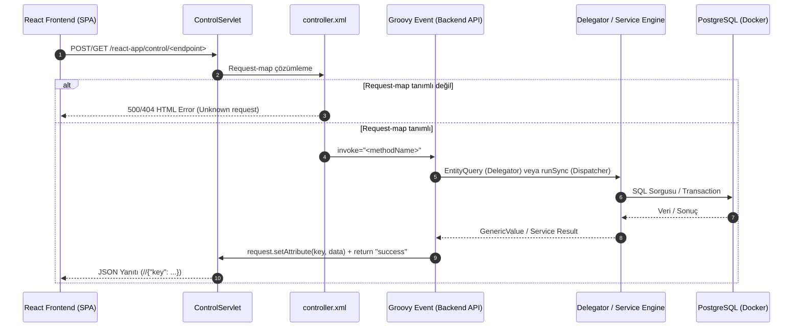

# OFBiz & Modern React Entegrasyon ve Modül Geliştirme El Kitabı (Playbook)

Bu kılavuz, Apache OFBiz'in köklü ERP iş mantığı ve kurumsal veri modelini, modern bir React SPA (Vite + TypeScript + TailwindCSS + Lucide + Framer Motion) arayüzüne kusursuz, güvenilir ve yüksek performanslı şekilde taşımak için geliştirilen ve **Muhasebe (Accounting) modülünün 5 fazında** bizzat doğrulanmış mimari yöntemleri, tasarım kalıplarını ve tuzak çözümlerini içerir.

Gelecekte geliştirilecek **Sipariş (Order)**, **Cari/Taraf (Party)**, **Ürün/Katalog (Product)**, **Depo/Stok (Facility)** ve **Üretim (Manufacturing)** modüllerinde bu playbook standart referans olarak uygulanmalıdır.

---

## 1. Mimari Vizyon ve İstek Akışı

OFBiz monolitik yapısında ekranlar XML Form/Screen widget'ları ve FTL (FreeMarker) şablonları ile sunulur. Modern mimaride OFBiz, **Headless ERP Motoru**; React ise **Modern İstemci (SPA)** olarak konumlandırılmıştır.



### Neden Groovy Events?
1. **Sıcak Yeniden Yükleme (Hot-Reloading):** Java sınıflarının aksine Groovy event dosyaları (`.groovy`), OFBiz yeniden başlatılmadan çalışma zamanında dinamik olarak derlenir ve güncellenir.
2. **Doğrudan Nesne Erişimi:** Groovy betiği içerisinde `delegator`, `dispatcher`, `request`, `response`, `parameters` doğrudan bağlamda (binding) hazırdır.
3. **Standart JSON Çıktısı:** `response type="request" value="json"` konfigürasyonu ile `request.setAttribute(...)` içine konan her veri Tomcat `ControlServlet` tarafından otomatik olarak JSON nesnesine dönüştürülür.

---

## 2. OFBiz Modülü Çözümleme ve Fazlandırma Metodolojisi

Mevcut bir OFBiz modülünü React'e taşırken uygulanması gereken 5 aşamalı yol haritası:

### Adım 1: Modülün OFBiz İçindeki Haritasını Çıkarın
- **Widget ve Ekranlar:** `applications/<modul>/widget/<Modul>Screens.xml` ve `*Forms.xml` dosyalarını inceleyerek kullanıcıya hangi alanların gösterildiğini ve hangi filtrelerin kullanıldığını tespit edin.
- **Varlık Modeli (Entities):** `applications/datamodel/entitydef/<modul>-entitymodel.xml` dosyasından birincil anahtarları (PK), ilişkileri (relations), Type ve Status tanımlarını çıkarın.
- **Servisler:** `applications/<modul>/servicedef/services*.xml` dosyasından hazır CRUD ve iş mantığı servislerini listeleyin.
- **ECA Kuralları (KRİTİK):** `servicedef/secas*.xml` ve `entitydef/eecas*.xml` dosyalarını kontrol ederek bir servis çalıştığında arka planda otomatik tetiklenen kuralları (örn: otomatik durum açılması, e-posta, muhasebe fişi) mutlaka tespit edin.

### Adım 2: Mantıksal Fazlara Bölün (Phased Roadmap)
Her modülü 3 ila 5 bağımsız, test edilebilir faza ayırın:
- **Faz 1: Ana İşlem Kayıtları & CRUD (Core Transactions)**
- **Faz 2: İşlem Hareketleri & Alt Kalemler (Line Items & Allocations)**
- **Faz 3: Durum Geçişleri & İş Akışı (State Machine & Workflow)**
- **Faz 4: Raporlama & Özet Göstergeler (Analytics & KPI Metrics)**
- **Faz 5: İleri Düzey & İlişkili Modüller (Advanced & Supporting Features)**

---

## 3. Backend Groovy Event Tasarım Kalıbı

Tüm backend endpoint'leri `plugins/react-app/src/main/groovy/org/apache/ofbiz/reactapp/<Modul>Events.groovy` dosyasında toplanır.

### Standart Şablon
```groovy
package org.apache.ofbiz.reactapp

import org.apache.ofbiz.base.util.*
import org.apache.ofbiz.entity.*
import org.apache.ofbiz.entity.condition.*
import org.apache.ofbiz.entity.util.EntityQuery
import org.apache.ofbiz.service.*
import java.sql.Timestamp

final String MODULE = "<Modul>Events.groovy"

/**
 * Oturum açmış kullanıcı yoksa sistem kullanıcısını döner.
 */
GenericValue getSystemUserLogin() {
    def delegator = binding.getVariable("delegator")
    def request = binding.getVariable("request")
    GenericValue userLogin = (GenericValue) request.getSession().getAttribute("userLogin")
    if (!userLogin) {
        userLogin = EntityQuery.use(delegator).from("UserLogin").where("userLoginId", "system").queryOne()
    }
    return userLogin
}

/**
 * 1. Metadata / Bootstrap Endpoint
 * Form açılır kutuları (select dropdown) için gerekli tüm tip ve durumları tek seferde döner.
 */
String getModuleMetadata() {
    def delegator = binding.getVariable("delegator")
    def request = binding.getVariable("request")
    try {
        List types = EntityQuery.use(delegator).from("SomeType").orderBy("description").queryList()
        List statuses = EntityQuery.use(delegator).from("StatusItem").where("statusTypeId", "SOME_STATUS").queryList()

        request.setAttribute("types", types.collect { [id: it.typeId, description: it.description ?: it.typeId] })
        request.setAttribute("statuses", statuses.collect { [id: it.statusId, description: it.description ?: it.statusId] })
        return "success"
    } catch (Exception e) {
        Debug.logError(e, "Error in getModuleMetadata", MODULE)
        request.setAttribute("_ERROR_MESSAGE_", e.getMessage())
        return "error"
    }
}
```

### Kritik Backend Tuzakları ve Çözümleri

#### TUZAK 1: `EntityQuery.where(null)` Belirsizlik Hatası (Ambiguous Overload)
Groovy derleyicisi `where(null)` çağrıldığında `where(Map)`, `where(List)` ve `where(EntityCondition)` arasında seçim yapamaz ve runtime hatası fırlatır.
- **Hatalı:**
  ```groovy
  EntityCondition cond = conditions.isEmpty() ? null : EntityCondition.makeCondition(conditions)
  def list = EntityQuery.use(delegator).from("Invoice").where(cond).queryList() // ÇÖKER!
  ```
- **Doğru Çözüm:**
  ```groovy
  def query = EntityQuery.use(delegator).from("Invoice")
  if (!conditions.isEmpty()) {
      query = query.where(EntityCondition.makeCondition(conditions, EntityOperator.AND))
  }
  List results = query.maxRows(viewSize).cursorScroll(false).queryList()
  ```

#### TUZAK 2: JTA Transaction Rollback & ECA Çakışması
OFBiz servis çağrılarında (`dispatcher.runSync`) bir servis hata verirse (örneğin duplicate primary key), bu çağrı `try-catch` içine alınsa dahi geçerli veritabanı işlemi (Transaction) `setRollbackOnly` olarak işaretlenir. İstek sonunda tüm transaction iptal edilir!
- **Muhasebe Örneği:** `createBudget` servisi zaten `secas.xml` kuralı gereği otomatik olarak `createBudgetStatus(BG_CREATED)` çalıştırır. Groovy kodunda manuel olarak tekrar `createBudgetStatus` çağrıldığında birincil anahtar çakışması yaşanmış ve bütçe kaydı tamamen geri alınmıştır.
- **Kural:** Bir servis çağırmadan önce `secas.xml` dosyasına bakın. Durum geçişlerinde doğrudan `create*` yerine OFBiz'in durum doğrulama mantığı içeren `update*Status` veya `change*Status` servislerini kullanın.

#### TUZAK 3: Tarih ve Zaman Dönüşümleri
React frontend'inden gelen tarihler genellikle ISO string (`"2026-09-18"` veya `"2026-09-18T14:30:00.000Z"`) formatındadır. OFBiz `Timestamp` veya `java.sql.Date` bekler.
```groovy
Timestamp parseTimestamp(String dateStr) {
    if (!dateStr) return null
    try {
        if (dateStr.length() == 10) dateStr += " 00:00:00"
        return Timestamp.valueOf(dateStr.replace("T", " ").replaceAll("Z", "").substring(0, 19))
    } catch (Exception e) {
        return UtilDateTime.nowTimestamp()
    }
}
```

---

## 4. Çift Controller ve Güvenlik Yapılandırması (Dual Controller Pattern)

### Vite Build Tuzağı ve Çift Controller Kuralı
`plugins/react-app/frontend/vite.config.ts` dosyasında `build.emptyOutDir: true` tanımlıdır. `npm run build` komutu verildiğinde `webapp/react-app/` dizini tamamen silinir ve `frontend/public/` içindeki dosyalar buraya kopyalanır.

> [!CAUTION]
> **ASLA** sadece `webapp/react-app/WEB-INF/controller.xml` dosyasını düzenlemeyin!
> Bir endpoint eklerken **her iki dosyaya da** eklemelisiniz:
> 1. `plugins/react-app/frontend/public/WEB-INF/controller.xml` (Kalıcı Kaynak)
> 2. `plugins/react-app/webapp/react-app/WEB-INF/controller.xml` (Çalışma Zamanı)

### Standart `request-map` Şablonu
```xml
<request-map uri="getMyEndpoint">
    <security https="false" auth="false"/>
    <event type="groovy" path="component://react-app/src/main/groovy/org/apache/ofbiz/reactapp/MyModuleEvents.groovy" invoke="getMyEndpoint"/>
    <response name="success" type="request" value="json"/>
    <response name="error" type="request" value="json"/>
</request-map>
```

### HTTP 302 Yönlendirme Tuzağı (`url.properties`)
OFBiz `8080` (HTTP) portundan gelen istekleri varsayılan olarak `8443` (HTTPS)'e yönlendirir. Tarayıcıda relative URL ile yapılan fetch istekleri 302 alır ve CORS / Network Error hatasına düşer.
- **Çözüm:** `framework/webapp/config/url.properties` dosyasında `http.request-map.list` virgüllü listesine eklediğiniz tüm endpoint isimlerini kaydedin:
  ```properties
  http.request-map.list=...,getMyEndpoint,createMyRecord,updateMyRecord
  ```

### Ağdan Erişim ve Host Header İzinleri (`security.properties`)
Uygulamaya yerel ağdan (`192.168.x.x`) veya IP ile bağlanıldığında OFBiz `host-headers-allowed` denetimi yapar. Eğer IP listede yoksa ControlServlet 500 HTML hata sayfası döner ve veriler yüklenmez.
- **Çözüm:** `framework/security/config/security.properties` içinde `host-headers-allowed` parametresine `192.168.*`, `10.*` wildcard tanımlarının bulunduğundan emin olun.

---

## 5. Frontend Mimari Şablonu (React + TypeScript + UI/UX)

### 1. `api.ts` Merkezi İstemci ve `//` Temizliği
OFBiz JSON çıktıları güvenlik gereği `//` öneki ile başlar. Merkezi API katmanı bu öneki temizlemeli ve HTML hata yanıtlarını yakalamalıdır:

```typescript
const cleanJson = (text: string) => {
  const trimmed = text.trim();
  if (trimmed.startsWith('<!DOCTYPE') || trimmed.startsWith('<html')) {
    throw new Error('OFBiz sunucusundan HTML hata sayfası döndü. Yetki veya endpoint tanımlarını kontrol edin.');
  }
  return trimmed.startsWith('//') ? trimmed.substring(2) : trimmed;
};

export async function fetchWithAuth<T>(url: string, options?: RequestInit): Promise<T> {
  const response = await fetch(url, {
    ...options,
    headers: {
      'Accept': 'application/json',
      ...options?.headers,
    },
  });
  const text = await response.text();
  const jsonStr = cleanJson(text);
  const data = JSON.parse(jsonStr);
  if (data._ERROR_MESSAGE_) {
    throw new Error(data._ERROR_MESSAGE_);
  }
  return data as T;
}
```

### 2. Standart Görünüm Mimarisi (Dashboard & Component Pattern)
Her modül ekranı 5 temel UI katmanından oluşur:

1. **Özet Gösterge Kartları (Metrics Row):** Toplam sayı, bekleyen işlem, onaylanan tutar gibi 3-4 adet KPI kutusu.
2. **Sekmeli Gezinme (Tabbed Navigation):** Modül altındaki ana kavramlar arasında geçiş (örn: Varlıklar, Amortisman, Bütçeler, Sözleşmeler).
3. **Filtre ve Arama Çubuğu (Filter Bar):** Anlık arama (Search input), Durum seçici (Status dropdown) ve "Yeni Ekle" aksiyon butonu.
4. **Veri Tablosu (Data Table):** Durum rozetleri (renkli badge'ler), biçimlendirilmiş para birimi (`₺` veya `$`), biçimlendirilmiş tarih ve sağ tarafta hızlı aksiyon butonları (İncele, Düzenle, Onayla).
5. **Kayar Çekmece (Slide-Over Drawer - Framer Motion):** Bir satıra tıklandığında sayfa yenilenmeden sağdan kayarak açılan detay çekmecesi. Alt kalemler (items), durum tarihçesi (history) ve ilişkili kayıtlar burada listelenir.
6. **İşlem Modalları (Action Modals):** Ekleme, düzenleme, durum değiştirme ve işlem gerçekleştirme formları. Gönderim esnasında loading animasyonu ve form kilitleme uygulanır.

---

## 6. Diğer Modüllere Uygulama Rehberi (Cookbook)

Aşağıdaki şablonları yeni modülleri geliştirirken doğrudan kullanabilirsiniz:

### A. Sipariş Yönetimi (Order Management)
- **Ana Varlıklar:** `OrderHeader`, `OrderItem`, `OrderRole`, `OrderStatus`, `OrderAdjustment`.
- **Durum Akışı:** `ORDER_CREATED` -> `ORDER_APPROVED` -> `ORDER_COMPLETED` (veya `ORDER_CANCELLED`).
- **Endpoint'ler:** `getOrders`, `getOrderDetails`, `createOrder`, `approveOrder`, `cancelOrder`, `addOrderItem`.
- **Önemli Servisler:** `createOrder`, `changeOrderStatus`, `quickShipEntireOrder`.

### B. Cari / Taraf Yönetimi (Party Management)
- **Ana Varlıklar:** `Party`, `Person` (Bireysel), `PartyGroup` (Kurumsal), `PartyRole`, `ContactMech`, `PostalAddress`, `TelecomNumber`.
- **Endpoint'ler:** `getParties`, `getPartyDetails`, `createPersonCustomer`, `createCorporateSupplier`, `addPartyContactMech`.
- **Önemli Servisler:** `createPerson`, `createPartyGroup`, `createPartyPostalAddress`, `createPartyTelecomNumber`.

### C. Ürün & Katalog (Catalog & Product)
- **Ana Varlıklar:** `Product`, `ProductCategory`, `ProductCategoryMember`, `ProductPrice`, `GoodIdentification` (Barkod/SKU).
- **Endpoint'ler:** `getProducts`, `getProductDetails`, `createProduct`, `updateProductPrice`, `assignProductCategory`.
- **Önemli Servisler:** `createProduct`, `updateProduct`, `createProductPrice`.

### D. Depo & Stok (Facility & Inventory)
- **Ana Varlıklar:** `Facility`, `InventoryItem`, `InventoryItemDetail`, `Shipment`, `ShipmentItem`.
- **Metrikler:** ATP (Available to Promise) ve QOH (Quantity on Hand).
- **Endpoint'ler:** `getFacilities`, `getInventoryItems`, `createInventoryItem`, `receiveInventoryItem`, `transferInventory`.
- **Önemli Servisler:** `createInventoryItem`, `createFacility`, `receiveInventoryProduct`.

---

## 7. Geliştirme ve Dağıtım Adım Adım Kontrol Listesi (Checklist)

Yeni bir modül geliştirirken bu adımları sırayla işaretleyin:

1. [ ] **Veri & Servis Analizi:** `entitymodel.xml` ve `services.xml` incelendi.
2. [ ] **ECA Denetimi:** `secas.xml` kontrol edildi; otomatik tetiklenen servisler belirlendi.
3. [ ] **Backend Groovy Event:** `plugins/react-app/src/main/groovy/.../<Modul>Events.groovy` yazıldı.
4. [ ] **Controller Senkronizasyonu:** Hem `frontend/public/.../controller.xml` hem `webapp/react-app/.../controller.xml` güncellendi.
5. [ ] **URL Whitelist:** `framework/webapp/config/url.properties` içine endpoint'ler eklendi.
6. [ ] **Frontend API:** `api.ts` içine interface'ler ve çağrı fonksiyonları eklendi.
7. [ ] **Frontend UI:** `src/components/<Modul>.tsx` bileşeni oluşturuldu, `App.tsx` ve `Layout.tsx` rotalarına bağlandı.
8. [ ] **Derleme:** `cd plugins/react-app/frontend && npm run build` çalıştırıldı.
9. [ ] **Canlı Doğrulama:** `curl` ile JSON yanıtı ve PostgreSQL üzerinden veritabanı kayıtları doğrulandı.
10. [ ] **Git Commit:** `git status` ve `git commit` yapıldı.
